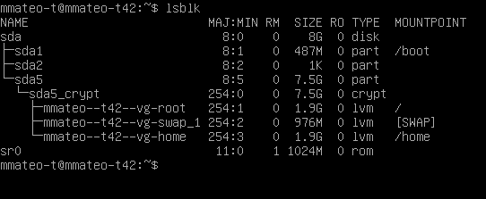
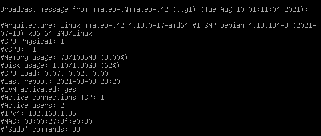

# born2beroot 👶

This project aims to introduce me to the wonderful world 🌍 of virtualization.

## Requisites 📑

## Files 📁
- 📝**signature.txt** -> This document contains a hash of my virtual disk image *(.vdi format)*

- 💿**born2beroot.ova** -> *(Not uploaded, too heavy)*

## Summary ⏬

This project consists of having you set up my first server by following specific rules 🔽

- 🖌️ No graphic interface 
- 💻 **Debian** Buster 10 
- 🛡️ **AppArmor** activated
- 🔐 2 encrypted partitions using **LVM**
___

___
- 🔏 **SSH** service on port 4242, it is impossible to connect as root
- 🔥 **UFW** firewall leave only port 4242 open
- 🚹 **Hostname** personalizated
- 🛑 Strong password policy
- 🦸 ***Sudo*** configured following strict rules
- 👫 Adding many users and groups
- 📄 **Script** that display some hardware and software information on all terminals every 10 minutes 🔽
___

___
## Links 🔗
- [VirtualBox User Manual](https://www.virtualbox.org/manual/UserManual.html)
- [Debian installation guide](https://www.debian.org/releases/jessie/i386/index.html.es)
- [Introduction to AppArmor](https://debian-handbook.info/browse/es-ES/stable/sect.apparmor.html)
- [LVM for fools](https://blog.inittab.org/administracion-sistemas/lvm-para-torpes-i/)
- [How to change SSH ports](https://www.cyberciti.biz/faq/howto-change-ssh-port-on-linux-or-unix-server/)
- [UFW](https://www.swhosting.com/es/comunidad/manual/que-es-el-firewall-ufw-y-como-configurarlo-en-linux)
- [Change hostname](https://www.cyberciti.biz/faq/how-to-change-hostname-on-debian-10-linux/)
- [Strong password policies](https://ostechnix.com/force-users-use-strong-passwords-debian-ubuntu/)
- [Crear users and groups](https://www.techrepublic.com/article/how-to-create-users-and-groups-in-linux-from-the-command-line/)
- [Sudo manual](https://www.linuxtotal.com.mx/index.php?cont=info_admon_014)
- [Wall command linux](https://linuxize.com/post/wall-command-in-linux/)
- [Cron command linux](https://www.redeszone.net/2017/01/09/utilizar-cron-crontab-linux-programar-tareas/)

### Bonus 🎀
[LLMP stack (Linux, lighttpd, MariaDB, PHP)](https://www.osradar.com/install-wordpress-with-lighttpd-debian-10/)

___

***In case you would like to try this VM, please contact me!*** 🙆‍♂️
